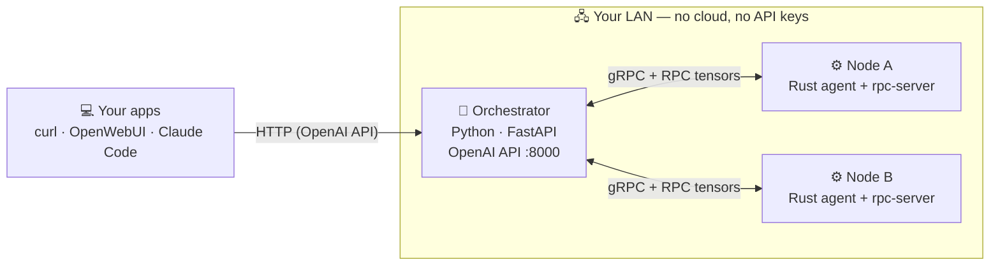
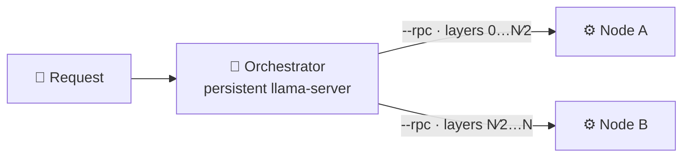

<div align="center">

# ⚡ ArcFlare

### Distributed LLM inference across scrap hardware

Chain old laptops, Raspberry Pis, and desktops into a single AI cluster.
ArcFlare splits a model across your devices so you can run models **larger than any single machine can hold** — privately, on your own LAN, for free.

<br/>


**[Quickstart](#-quickstart) · [Install](#-install) · [Windows](#-windows) · [API](#-api) · [How it works](#-how-it-works) · [Roadmap](#-roadmap)**

</div>

---

## 🚀 Quickstart

Try the whole stack on one machine with Docker:

```bash
git clone https://github.com/Hakeperty/arcflare.git
cd arcflare
docker compose up -d

curl http://localhost:8000/v1/chat/completions \
  -H "Content-Type: application/json" \
  -d '{"model":"arcflare/default","messages":[{"role":"user","content":"Hello!"}]}'
```

Then open the live dashboard at **<http://localhost:8000/dashboard>**.

To build a real multi-machine cluster, see [Install](#-install) below.

---

## ✨ How it works



1. **Each machine** runs a lightweight `node-agent` (Rust); one machine runs the orchestrator (Python).
2. **Nodes auto-discover** each other via UDP broadcast — no config needed.
3. **The orchestrator** coordinates inference, splitting the model's tensors across nodes with llama.cpp's RPC backend.
4. **You interact** through an OpenAI-compatible API at `http://<orchestrator>:8000`.

---

## 📦 Install

> **Prerequisites per OS are collapsed below — open the one you need.** After that, every platform follows the same numbered steps.

<details>
<summary><b>🐧 Linux (Ubuntu/Debian)</b></summary>

```bash
sudo apt install cmake build-essential clang libclang-dev
curl --proto '=https' --tlsv1.2 -sSf https://sh.rustup.rs | sh -s -- -y --default-toolchain nightly
source "$HOME/.cargo/env"
```
</details>

<details>
<summary><b>🍎 macOS</b></summary>

```bash
brew install cmake llvm
curl --proto '=https' --tlsv1.2 -sSf https://sh.rustup.rs | sh -s -- -y --default-toolchain nightly
source "$HOME/.cargo/env"
```
</details>

<details>
<summary><b>🍓 Raspberry Pi (ARM)</b></summary>

```bash
sudo apt install cmake build-essential clang libclang-dev
curl --proto '=https' --tlsv1.2 -sSf https://sh.rustup.rs | sh -s -- -y --default-toolchain nightly
source "$HOME/.cargo/env"
```
</details>

<details>
<summary><b>🪟 Windows</b> — see the dedicated <a href="#-windows">Windows section</a></summary>

The Rust node-agent currently targets Linux. On Windows, run the cluster inside **WSL2** (full features) or add a Windows box as a **native compute worker**. Jump to **[Windows](#-windows)**.
</details>

### 1 — Clone

```bash
git clone https://github.com/Hakeperty/arcflare.git
cd arcflare
```

### 2 — Python deps (orchestrator machine only)

```bash
pip install -r orchestrator/requirements.txt
```

### 3 — Build the node agent (every machine)

```bash
cargo build --release -p node-agent
sudo cp target/release/node-agent /usr/local/bin/arcflare-node
```

### 4 — Download a model (orchestrator machine)

ArcFlare uses GGUF models (see [llama.cpp](https://github.com/ggml-org/llama.cpp)):

```bash
mkdir -p models
pip install huggingface-hub
python3 -c "
from huggingface_hub import hf_hub_download
hf_hub_download(
    repo_id='Qwen/Qwen2.5-0.5B-Instruct-GGUF',
    filename='qwen2.5-0.5b-instruct-q4_k_m.gguf',
    local_dir='models',
)"
```

### 5 — Install llama.cpp binaries (orchestrator machine)

```bash
curl -sL "https://github.com/ggml-org/llama.cpp/releases/download/b9547/llama-b9547-bin-ubuntu-x64.tar.gz" \
  | tar -xz --strip=1 -C /usr/local/bin '*/llama-cli' '*/llama-server'
llama-cli --version   # verify
```

For distributed (multi-machine) inference you also need `llama-rpc-server`. Build it once with RPC enabled, or grab it from a release that bundles it:

```bash
git clone https://github.com/ggml-org/llama.cpp && cd llama.cpp
cmake -B build -DLLAMA_RPC=ON
cmake --build build --config Release -j$(nproc)
sudo cp build/bin/rpc-server /usr/local/bin/llama-rpc-server
```

### 6 — Start the orchestrator (pick one machine)

```bash
cd orchestrator/src
ARCFLARE_LLAMA_CLI=/usr/local/bin/llama-cli \
ARCFLARE_LLAMA_SERVER=/usr/local/bin/llama-server \
ARCFLARE_MODELS_DIR="$HOME/arcflare/models" \
uvicorn arcflare.main:app --host 0.0.0.0 --port 8000
```

### 7 — Join nodes to the cluster

**Basic (single-node forwarding):**

```bash
arcflare-node --orchestrator-host <orchestrator-ip>
```

**Distributed (RPC tensor split — recommended):** each node runs its own `llama-rpc-server`; the orchestrator splits tensors across all of them.

```bash
arcflare-node \
    --orchestrator-host <orchestrator-ip> \
    --enable-rpc \
    --rpc-port 10001 \
    --rpc-server-bin /usr/local/bin/llama-rpc-server
```

The orchestrator detects the rpc endpoints automatically and switches to RPC mode.

### 8 — Verify & chat

```bash
curl http://<orchestrator-ip>:8000/api/cluster/status     # all nodes should be listed

curl -X POST http://<orchestrator-ip>:8000/v1/chat/completions \
  -H "Content-Type: application/json" \
  -d '{"model":"arcflare/default","messages":[{"role":"user","content":"Hello!"}]}'
```

<details>
<summary><b>Alternative: local dev cluster (all on one machine)</b></summary>

```bash
# Terminal 1 — orchestrator
cd orchestrator/src
ARCFLARE_LLAMA_CLI=/usr/local/bin/llama-cli \
ARCFLARE_LLAMA_SERVER=/usr/local/bin/llama-server \
ARCFLARE_MODELS_DIR="$HOME/arcflare/models" \
uvicorn arcflare.main:app --host 0.0.0.0 --port 8000

# Terminal 2 — node alpha
arcflare-node --orchestrator-host 127.0.0.1 --grpc-port 9001 --name alpha

# Terminal 3 — node beta
arcflare-node --orchestrator-host 127.0.0.1 --grpc-port 9002 --name beta
```
</details>

---

## 🪟 Windows

The Rust node-agent reads `/proc` and `/sys` for hardware detection and tuning, so a **native** Windows agent isn't supported yet (it's on the [roadmap](#-roadmap)). Two paths work on Windows **today**:

### Option A — WSL2 (recommended, full features)

Run the whole cluster inside WSL2 — it's a real Linux kernel, so everything above works unchanged.

```powershell
wsl --install -d Ubuntu      # reboot if prompted, then open the Ubuntu shell
```

Inside the Ubuntu shell, follow the [Linux install steps](#-install) exactly. To let **other machines on your LAN** reach an orchestrator running in WSL2 (WSL2 sits behind NAT), forward the port from Windows:

```powershell
# run in an Administrator PowerShell; grab the WSL IP first
$wslIp = (wsl hostname -I).Trim().Split(" ")[0]
netsh interface portproxy add v4tov4 listenport=8000 listenaddress=0.0.0.0 connectport=8000 connectaddress=$wslIp
netsh advfirewall firewall add rule name="ArcFlare 8000" dir=in action=allow protocol=TCP localport=8000
```

### Option B — Native Windows orchestrator

The Python orchestrator runs natively on Windows. Download the llama.cpp **Windows** build (`llama-bXXXX-bin-win-*.zip`) from [Releases](https://github.com/ggml-org/llama.cpp/releases) and point ArcFlare at the `.exe`s:

```powershell
git clone https://github.com/Hakeperty/arcflare.git
cd arcflare\orchestrator
pip install -r requirements.txt

$env:ARCFLARE_LLAMA_SERVER = "C:\llama\llama-server.exe"
$env:ARCFLARE_LLAMA_CLI    = "C:\llama\llama-cli.exe"
$env:ARCFLARE_MODELS_DIR   = "C:\arcflare\models"
cd src
uvicorn arcflare.main:app --host 0.0.0.0 --port 8000
```

### Option C — Add a native Windows box as a compute worker

Even without the Rust agent, a Windows machine can contribute its CPU/GPU to the tensor split. Run llama.cpp's `rpc-server.exe`, then register it with the orchestrator:

```powershell
# 1) start the RPC worker (from the llama.cpp Windows build)
C:\llama\rpc-server.exe -H 0.0.0.0 -p 10001

# 2) register this box with the orchestrator (its IP is detected from the request)
Invoke-RestMethod -Method Post "http://<orchestrator-ip>:8000/api/nodes/register" `
  -ContentType "application/json" `
  -Body '{"node_id":"win-1","name":"windows-box","rpc_port":10001}'
```

The orchestrator adds `<this-box-ip>:10001` to its RPC endpoints and includes the Windows machine in the distributed inference. (Hardware-summary auto-reporting and tuning stay Linux-only for now.)

---

## 🔌 API

ArcFlare is **OpenAI API compatible** — point any OpenAI client/tool at it.

```bash
# List models
curl http://localhost:8000/v1/models

# Chat (streaming)
curl -X POST http://localhost:8000/v1/chat/completions \
  -H "Content-Type: application/json" \
  -d '{"model":"arcflare/default","messages":[{"role":"user","content":"Hello"}],"stream":true}'

# Completions
curl -X POST http://localhost:8000/v1/completions \
  -H "Content-Type: application/json" \
  -d '{"model":"arcflare/default","prompt":"Once upon a time","max_tokens":100}'
```

<details>
<summary><b>Management API</b></summary>

```bash
curl http://localhost:8000/api/cluster/status      # cluster summary + pipeline_mode
curl http://localhost:8000/api/nodes               # registered nodes
curl http://localhost:8000/api/nodes/<node-id>     # one node's detail
```
</details>

---

## 🧬 Pipeline parallelism

When nodes run with `--enable-rpc`, the orchestrator detects their `llama-rpc-server` endpoints and upgrades from single-node to true distributed inference:



The orchestrator picks the inference mode in this order:

1. **`rpc_distributed`** — ≥2 rpc endpoints; tensors split across the cluster via `--rpc`.
2. **`single_rpc`** — exactly one rpc endpoint.
3. **`local_fallback`** — no rpc nodes; runs `llama-cli`/`llama-server` on the orchestrator.

The active mode is reported in `/api/cluster/status` as `pipeline_mode`.

### Persistent model server

By default the orchestrator keeps **one long-lived `llama-server`** instead of spawning a fresh `llama-cli` per request. The model loads once (and, in RPC mode, its tensors ship to the nodes once); subsequent requests just stream tokens. This cut warm-request latency from **~23 s** (reload every time) to **~0.8–1.4 s** in testing. The server restarts automatically when the model or the set of RPC nodes changes — set `ARCFLARE_LLAMA_SERVER`, or it's auto-discovered next to `llama-cli`.

---

## 🖥️ Web dashboard

Open **`http://<orchestrator>:8000/dashboard`** for a live view of the cluster: status, total RAM/GPUs, `pipeline_mode`, the node table (with RPC endpoints), and an inference tester. Pure HTML/JS, no build step, responsive on phone and desktop, refreshes every 3 s.

## ❤️ Health monitoring & crash recovery

The orchestrator actively probes each node every 10 s. A node whose port is refused for 3 consecutive checks is dropped; a busy-but-alive node (its probe times out while serving) is kept. When a node disappears, the persistent `llama-server` is reconfigured to use the survivors — a crashed worker **degrades** the cluster instead of breaking it. `/api/cluster/status` reports a `degraded` count.

## 📡 Auto-discovery

Nodes on the same LAN find each other automatically:

1. Each node broadcasts a UDP heartbeat on port **5678** every 5 s.
2. The orchestrator listens and registers new nodes.
3. Nodes also register via `POST http://<orchestrator>:8000/api/nodes/register`.
4. No manual IP configuration — just run the agent.

## 🔎 Hardware detection

Each node reports its hardware so the orchestrator can plan the tensor split:

- **CPU** — cores, architecture, frequency
- **RAM** — total and available
- **GPU** — vendor, model, VRAM
- **Drivers** — NVIDIA/CUDA status, Vulkan support

## 🔧 Overclocking & tuning

Optional performance tuning for scrap hardware:

| Mode | What it does |
|---|---|
| **Safe** (default) | governor tweaks, hugepages, IO scheduler |
| **System tuning** | kernel params, swappiness, NUMA balancing |
| **Aggressive** | overclock CPU, undervolt, GPU power/clock limits |
| **Driver audit** | checks for outdated GPU drivers (read-only) |

```bash
curl -X POST http://localhost:8000/api/nodes/<id>/tune
curl -X POST http://localhost:8000/api/nodes/<id>/benchmark
```

> ⚠️ Aggressive tuning changes real hardware limits (undervolt/overclock). Only use it on machines you control and can monitor.

---

## 🏗️ Architecture

```
arcflare/
├── node-agent/           # Rust — runs on each node
│   └── src/
│       ├── hardware/     # CPU/GPU/RAM detection
│       ├── overclocking/ # safe + aggressive tuning
│       ├── drivers/      # GPU driver audit
│       ├── tuning/       # system optimization
│       ├── inference/    # rpc-server lifecycle + forward pass
│       └── network/      # gRPC server + UDP discovery
├── orchestrator/         # Python — cluster brain
│   └── src/arcflare/
│       ├── api/          # OpenAI-compatible + management + dashboard
│       ├── cluster/      # discovery, health monitoring
│       ├── inference/    # pipeline + persistent llama-server
│       └── models/       # download + shard management
├── proto/                # gRPC service definitions
└── tools/gguf-splitter/  # GGUF analysis + partition planner
```

## 🧪 Development

```bash
# Build the agent
cargo build --release -p node-agent

# Tests
pip install -r orchestrator/requirements-dev.txt
python3 -m pytest orchestrator/tests/   # 15 tests, no GPU/model needed
cargo build -p node-agent               # compiles on default features
```

ArcFlare ships with a 3-VM QEMU/KVM harness that validates the full stack end-to-end — real agent, auto-registration, distributed inference, and crash recovery.

## 🗺️ Roadmap

**Phase 1 — foundation** ✅
- [x] gRPC protocol, node agent, hardware detection
- [x] UDP discovery, orchestrator + node registry
- [x] GGUF splitter, overclocking, driver audit, system tuning
- [x] OpenAI-compatible API, Docker cluster, real inference via llama-cli

**Phase 2 — distributed inference** ✅
- [x] Full distributed pipeline — llama.cpp RPC backend
- [x] Persistent `llama-server` (~23 s → ~0.8–1.4 s warm)
- [ ] P2P shard transfer (libp2p)
- [ ] Custom layer-partitioning engine
- [ ] KV-cache optimization

**Phase 3 — resilience & UX** 🔜
- [x] Web dashboard (`/dashboard`), responsive
- [x] Crash recovery — active health monitoring, auto-drop dead nodes, llama-server reconfigures around survivors
- [x] Windows support via WSL2 + native RPC worker
- [ ] Native Windows node agent (hardware detect + tuning)
- [ ] Live re-partitioning
- [ ] Authentication for orchestrator/agent APIs (shared token / mTLS)

## 🔐 Security

The orchestrator and node APIs are **unauthenticated by design** — ArcFlare is a trusted-LAN tool. **Do not expose ports `8000` / `9001` / the rpc ports to the internet.** Run the cluster on a private LAN (or a WireGuard/Tailscale overlay) only.

## 📄 License

MIT
